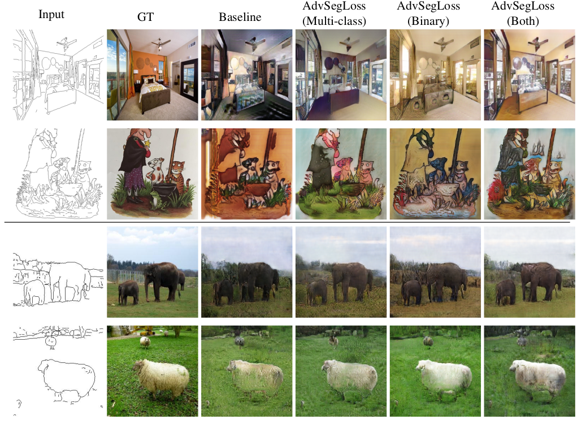

# AdvSegLoss

We provide PyTorch implementation for:

Adversarial Segmentation Loss for Sketch Colorization

[comment]: <> ([Paper]&#40;&#41;)

[Arxiv](https://arxiv.org/abs/2102.06192)


**AdvSegLoss**:

**Visual comparison with other methods:**



**FID score comparison with other methods:**


## Prerequisites
- Linux, macOS or Windows
- Python 3.7
- CPU or NVIDIA GPU + CUDA CuDNN

## Getting Started
### Downloading Datasets
Please refer to [datasets.md](docs/datasets.md) for details.

### Installation

- Clone this repo:
```bash
git clone https://github.com/giddyyupp/AdvSegLoss.git
cd AdvSegLoss
```
- Install PyTorch 1.7.0 and torchvision from https://pytorch.org/get-started/locally.

```bash
conda install pytorch=1.7.0 torchvision cudatoolkit=11.0 -c pytorch
```

Or install all deps using pip:
```bash
pip install -r requirements.txt
```

Download panoptic segmentation [model](https://dl.fbaipublicfiles.com/detectron2/COCO-PanopticSegmentation/panoptic_fpn_R_50_3x/139514569/model_final_c10459.pkl) 
from detectron model zoo, and put it under `models/segmentation/detectron2`.

### AdvSegLoss train/test
- Download a dataset (e.g. bedroom) and generate edge maps:

Follow steps in the [datasets.md](docs/datasets.md) to download, and prepare datasets.

- Train a model with unpaired training:
```bash
#!./scripts/train_advsegloss.sh
python train.py --checkpoints_dir ./checkpoints --name ade20k_hed_advsegloss_both --dataroot ./datasets/ade20k_hed --model cycle_gan --segmentation --segmentation_output "both" --direction "AtoB" --dataset_mode "unaligned"
```
- To view training results and loss plots, run `python -m visdom.server` and click the URL http://localhost:8097. To see more intermediate results, check out `./checkpoints/maps_cyclegan/web/index.html`
- Test the model:
```bash
#!./scripts/test_advsegloss.sh
python test.py --checkpoints_dir ./checkpoints --name ade20k_hed_advsegloss_both --dataroot ./datasets/ade20k_hed --model test --segmentation --segmentation_output "both" --direction "AtoB" --dataset_mode "unaligned"
```
The test results will be saved to a html file here: `./results/ade20k_hed_advsegloss_both/latest_test/index.html`.

You can find more scripts at `scripts` directory.

### Apply a pre-trained model
- You can download pretrained models using following [link](https://drive.google.com/drive/folders/15osbtUQxLyG_EnO7HHq4rBaoLU0BkMpP?usp=sharing)

Put a pretrained model under `./checkpoints/{name}_pretrained/100_net_G.pth`.

- Then generate the results using
```bash
python test.py --dataroot datasets/ade20k_hed/testB --name {name}_pretrained --model test --segmentation --segmentation_output "both" --direction "AtoB" --dataset_mode "unaligned"
```

The results will be saved at `./results/`. Use `--results_dir {directory_path_to_save_result}` to specify the results directory.


## [Training/Test Tips](docs/tips.md)
Best practice for training and testing your models.

## [Frequently Asked Questions](docs/qa.md)
Before you post a new question, please first look at the above Q & A and existing GitHub issues.


[comment]: <> (## Citation)

[comment]: <> (If you use this code for your research, please cite our papers.)

[comment]: <> (```)

[comment]: <> (@article{hicsonmez2020ganilla,)

[comment]: <> (  title={GANILLA: Generative adversarial networks for image to illustration translation},)

[comment]: <> (  author={Hicsonmez, Samet and Samet, Nermin and Akbas, Emre and Duygulu, Pinar},)

[comment]: <> (  journal={Image and Vision Computing},)

[comment]: <> (  pages={103886},)

[comment]: <> (  year={2020},)

[comment]: <> (  publisher={Elsevier})

[comment]: <> (})

[comment]: <> (```)
## Acknowledgments
Our code is based on [Ganilla](https://github.com/giddyyupp/ganilla).

The numerical calculations reported in this work were fully performed at TUBITAK ULAKBIM, High Performance and Grid Computing Center (TRUBA resources).
